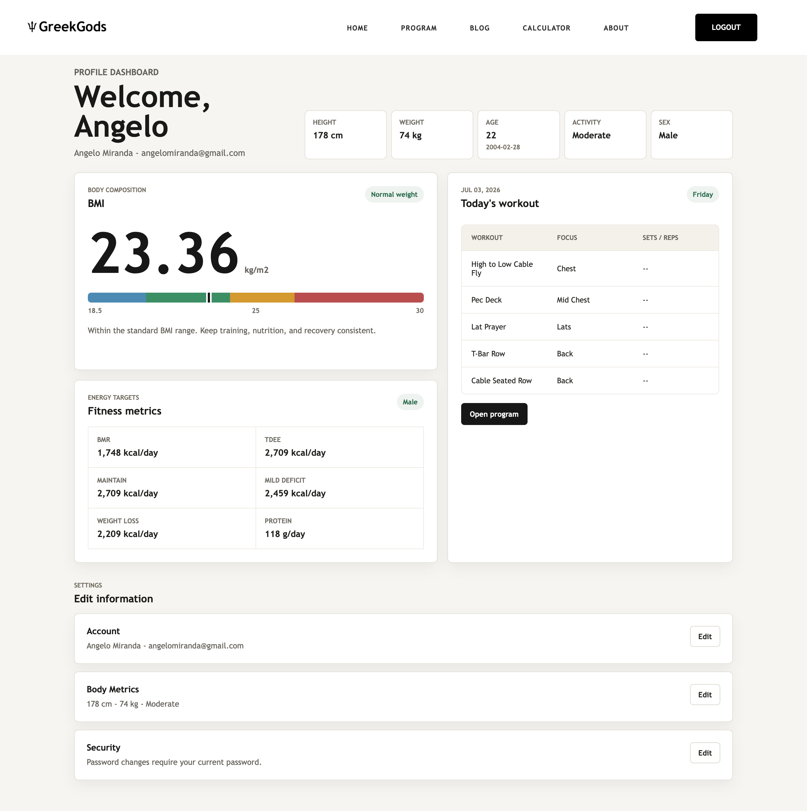

# GreekGods

GreekGods is a Laravel fitness planning application for creating weekly workout programs, managing personal body metrics, and estimating training-related nutrition targets. The project began as a PHP fitness website and was migrated into a Laravel application with Blade views, session authentication, PostgreSQL persistence, OAuth login, and Vercel deployment support.

## Table of Contents

- [Preview](#preview)
- [Tech Stack](#tech-stack)
- [Features](#features)
- [Usage](#usage)
- [Constraints and Future Improvements](#constraints-and-future-improvements)
- [License](#license)

## Preview

| Preview | Description |
| --- | --- |
|  | Home page with the main navigation and fitness hero section. |
|  | Login screen for returning users. |
|  | Account registration screen for collecting user credentials and fitness profile details. |
|  | Registration flow continuation for completing required profile information. |
|  | Profile dashboard showing saved body metrics, BMI, calorie targets, and today's workout. |
|  | Program builder split-selection step with available workout split templates. |
|  | Weekly workout board with schedule mapping, rest-day locking, and editable workouts. |
|  | Blog index for fitness education and training articles. |
|  | Beginner-focused article page for learning core fitness concepts. |
|  | BMI calculator page for estimating body composition category from height and weight. |

## Tech Stack

| Technology        | Role                                                                                                          |
| ----------------- | ------------------------------------------------------------------------------------------------------------- |
| PHP 8.3           | Main server-side language for the Laravel application and migration scripts.                                  |
| Laravel 13        | Application framework for routing, controllers, validation, sessions, Eloquent models, migrations, and tests. |
| Blade             | Server-rendered view layer for the app layout, auth screens, profile dashboard, and program builder.          |
| JavaScript        | Powers interactive profile and workout-program behavior on the client side.                                   |
| Tailwind CSS 4    | Styles the Laravel views, legacy pages, and Vite-managed frontend assets.                                     |
| PostgreSQL        | Primary relational database for users, body metrics, programs, workouts, sessions, cache, and jobs.           |
| Supabase          | Hosted PostgreSQL target used by the documented deployment setup.                                             |
| Laravel Socialite | Google and Microsoft OAuth login, account linking, and social signup flow.                                    |
| Vite              | Frontend build tool for compiling application CSS and JavaScript assets.                                      |

## Features

- Email/password registration and login with Laravel session authentication.
- Google and Microsoft OAuth login with account linking and a profile-completion step for new social signups.
- Profile dashboard with height, weight, age, activity level, sex, BMI, BMR, TDEE, calorie targets, and protein estimates.
- Metric conversion for height and weight across `cm`, `m`, `in`, `ft`, `kg`, and `lb`.
- Workout split catalog covering full body, upper/lower, PPL, PPL/Upper/Lower, PPL/Upper/ShArms, Arnold, and body-part splits.
- Weekly program builder with schedule selection, preconfigured workout templates, editable workouts, and rest-day restrictions.
- Legacy URL redirects for previous `/files/*.php`, `/files/*.html`, `/articles/*.php`, and `index.php` routes.
- Supabase PostgreSQL configuration and Vercel deployment support.

## Usage

To use the web app navigate to the repository 'about' panel and click the link.

## Constraints and Future Improvements

- Some legacy PHP, CSS, and JavaScript assets remain in the repository while the Laravel migration is in progress.
- The preview images are stored as static screenshots rather than generated from an automated visual test workflow.
- Workout recommendations are rule/template based; future versions could support progression history, set completion tracking, and analytics.
- The current database target is PostgreSQL/Supabase; local SQLite setup is not the primary documented path.
- Additional tests would improve confidence around social auth edge cases, profile metric validation, and workout schedule constraints.
- CI/CD could be added to run tests, formatting, and build checks before deployment.

## License

This project is licensed under the [MIT License](LICENSE).
