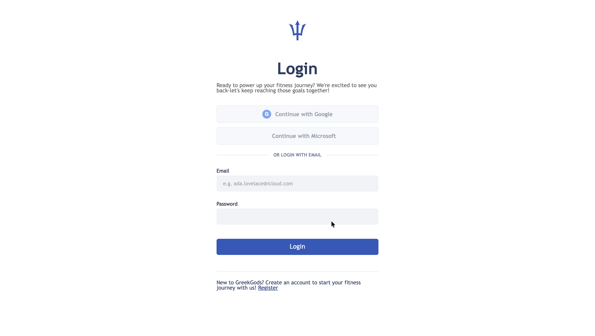
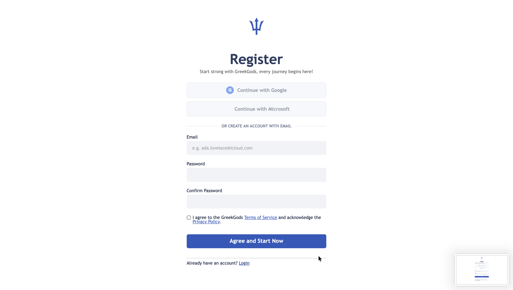
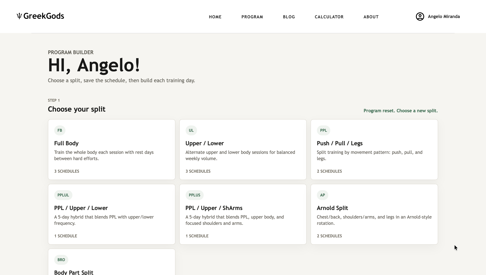
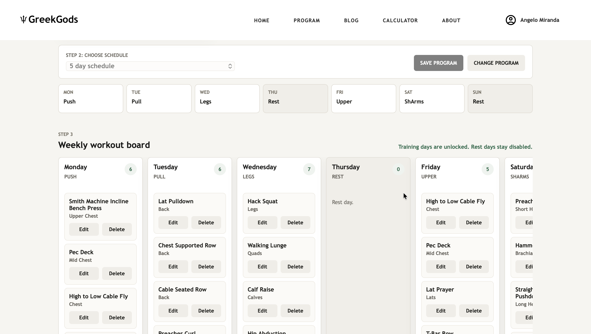
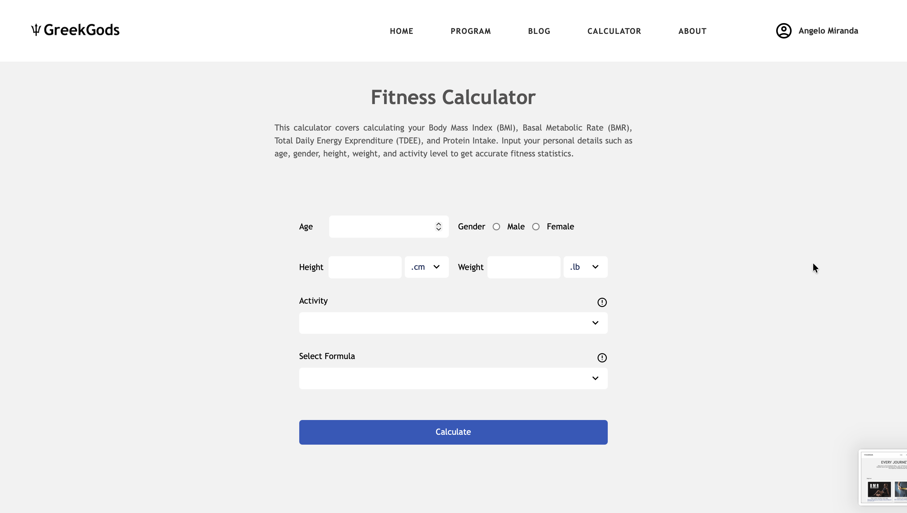

# GreekGods


GreekGods is a Laravel fitness-planning application for creating weekly workout programs, managing body metrics, and estimating training-related nutrition targets. Laravel is the sole supported runtime: routes, authentication, validation, persistence, and server-rendered pages all live inside the framework.

## Preview

| Preview | Description |
| --- | --- |
|  | Home page with the main navigation and fitness hero section. |
|  | Login screen for returning users. |
|  | Account registration screen for collecting user credentials and fitness profile details. |
|  | Registration flow continuation for completing required profile information. |
|  | Updated Profile dashboard with body metrics, BMI status, calorie and protein targets, today’s workout, and account settings. |
|  | Updated Program builder selection page with guided split and schedule choices. |
|  | Updated weekly Program editor with training and recovery days, workout controls, and horizontal navigation. |
|  | Blog index for fitness education and training articles. |
|  | Beginner-focused article page for learning core fitness concepts. |
|  | Updated Calculator for estimating BMI, BMR, TDEE, daily protein, and calorie targets. |

## Tech stack

| Technology | Role |
| --- | --- |
| PHP 8.3 / Laravel 13 | Routing, controllers, validation, authentication, Eloquent models, migrations, and tests |
| Blade | Shared layouts, components, pages, authentication screens, and article rendering |
| PostgreSQL / Supabase | Production relational data store |
| SQLite | Fast local and automated test database |
| Vanilla JavaScript | Program builder, profile interactions, calculator, dialogs, and toast integration |
| CSS custom properties | Shared GreekGods palette and page-level responsive styling |
| Vite | The only authored CSS and JavaScript build pipeline |
| Laravel Socialite | Google and Microsoft OAuth login and account linking |

## Features

- Email/password and Google/Microsoft authentication.
- Profile dashboard with body metrics and calculated fitness estimates.
- Guided two-step Program builder with reusable workout split templates.
- Atomic program replacement and authenticated workout CRUD.
- Horizontal seven-day workout navigation with compact landscape recovery cards.
- Browser-local BMI, BMR, TDEE, calorie-target, and protein calculator.
- Data-driven Blog catalog and one structured article renderer.
- Accessible confirmation dialogs and application-wide mutation toasts.
- Historical URL redirects for the removed PHP/HTML application.

## Local setup

Requirements: PHP 8.3+, Composer, Node.js, npm, and the PHP extensions required by Laravel.

```bash
git clone <repository-url>
cd greekgods
composer install
npm install
cp .env.example .env
php artisan key:generate
php artisan migrate
npm run build
```

For a simple local setup, configure SQLite in `.env`. PostgreSQL environment variables can be used for Supabase or another production-compatible database.

Start Laravel and Vite together:

```bash
npm run dev
```

Open `http://127.0.0.1:8000`. The Vite URL on port 5173 serves frontend assets and is not the application page by itself.

For production deployments, set `APP_ENV=production` and set `APP_URL` to the
complete HTTPS origin, for example `https://greekgods-psi.vercel.app`. GreekGods
also trusts Vercel's forwarded HTTPS headers so generated Vite, Livewire, OAuth,
and application URLs are not blocked as mixed content.

## Development and verification

```bash
php artisan test
npm run test:calculator
npm run build
php artisan route:list
php artisan view:cache
php artisan view:clear
```

The repository deliberately keeps generated Vite output, compiled Blade views, sessions, logs, and local secrets out of version control.

## Repository structure

```text
app/
  Content/                Article catalog access
  Http/                   Controllers and request validation
  Models/                 Eloquent models
  Support/                Workout catalog and shared domain support
database/
  migrations/             Laravel schema history
  factories/              Test data factories
resources/
  content/                Structured article data
  css/                    Shared palette/site CSS and page modules
  js/                     Shared runtime and page modules
  views/                  Blade layouts, components, pages, and articles
public/
  graphics/               Deployable images and interface assets
  fonts/                  Deployable local fonts
routes/
  web.php                 Canonical routes and historical redirects
tests/
  Feature/                Laravel behavior and repository checks
  js/                     Calculator unit tests
```

Authored frontend files belong in `resources`, never in a mirrored root or `public/files` source tree. `public` is reserved for deployable static media and Vite build output.

## Migration status and editorial follow-up

The previous standalone PHP runtime, database helpers, duplicated source/public assets, and one-time MySQL-to-PostgreSQL scripts have been removed. Legacy URLs continue to redirect through Laravel.

The article catalog intentionally preserves the previous prose. Two known editorial issues remain separate from this structural cleanup:

- `workout-splits` currently duplicates BMR-oriented content.
- `bmr-vs-tdee` is incomplete.

## License

This project is licensed under the [MIT License](LICENSE).
